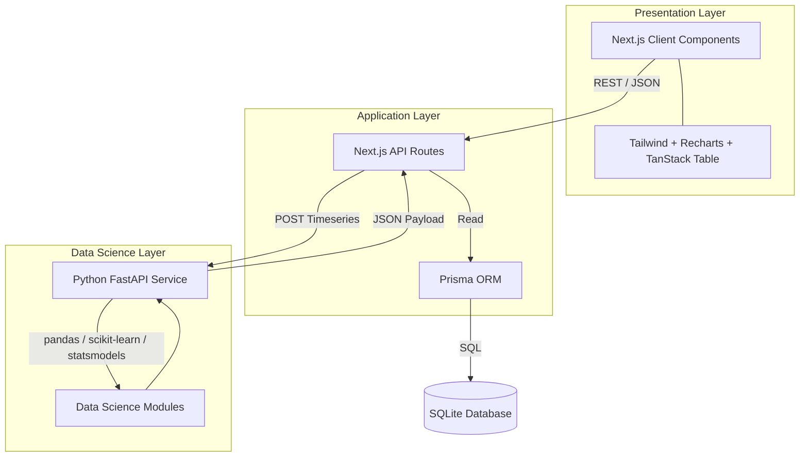

# Northstar Commerce Intelligence

### What this is
Northstar Commerce Intelligence is a production-grade, full-stack revenue analytics platform designed for e-commerce category managers and marketing teams. It unifies raw transaction data into a cohesive analytical model to solve the problem of siloed e-commerce metrics. By providing deep statistical insights—ranging from RFM customer segmentation and market basket affinity to predictive ARIMA forecasting—it enables operators to make daily, data-driven decisions on product bundling, marketing channel allocation, and inventory planning.

---

### Architecture



---

### Tech stack

| Layer | Technology | Why |
|-------|------------|-----|
| **Frontend Framework** | Next.js 14 (App Router) | Provides seamless server-side routing, optimized asset delivery, and an intuitive API route system for proxying requests. |
| **UI & Styling** | Tailwind CSS & Lucide Icons | Allows rapid, utility-first UI development resulting in a premium, highly responsive custom aesthetic. |
| **Data Visualization** | Recharts & TanStack Table | Recharts offers declarative, highly customizable SVG charts; TanStack provides a headless, robust foundation for complex data grids. |
| **Database & ORM** | SQLite & Prisma ORM | Prisma ensures end-to-end type safety against the database schema, while SQLite offers a zero-config, portable data store ideal for analytics prototyping. |
| **Data Science Microservice** | Python FastAPI | FastAPI provides a hyper-performant async framework to expose Python's unparalleled ecosystem for statistical modeling. |
| **Analytical Engine** | Pandas, Scikit-learn, Statsmodels, Mlxtend | Industry standards for data manipulation, unsupervised clustering (RFM), timeseries forecasting (ARIMA), and association rule learning (Apriori). |

---

### Analytics implemented

#### 1. Core Overview
1. **Net Revenue**: `Gross Revenue - Refunds - Discounts`
2. **Gross Revenue**: `Total item value before deductions`
3. **Total Orders**: `Count of distinct completed transactions`
4. **Average Order Value (AOV)**: `Net Revenue / Total Orders`
5. **Units Sold**: `Sum of all items in completed orders`
6. **Repeat Customer Rate**: `Customers with >1 order / Total Customers`
7. **Refund Rate**: `Refunded Revenue / Gross Revenue`

#### 2. Revenue Quality
8. **Discounts %**: `Total Discounts / Gross Revenue`
9. **Refunds %**: `Total Refunds / Gross Revenue`
10. **Net Margin Contribution**: `(Net Revenue - COGS) / Net Revenue` *(proxy)*
11. **Gross Revenue per Day**: `Daily aggregation of gross`
12. **Net Revenue per Day**: `Daily aggregation of net`
13. **Pareto Top 20% Contribution**: `Revenue of top 20% products / Total Revenue`
14. **Pareto Bottom 80% Contribution**: `Revenue of remaining products / Total Revenue`

#### 3. Product Performance
15. **Product Revenue**: `Sum of order item totals per product`
16. **Product Volume**: `Sum of quantities sold per product`
17. **Product Refund Rate**: `Refunded items / Sold items per product`
18. **Product Discount Impact**: `Discount value allocated to product`
19. **ABC Classification - A (Top 70%)**: `Products generating top 70% of cumulative revenue`
20. **ABC Classification - B (Next 20%)**: `Products generating next 20% of revenue`
21. **ABC Classification - C (Bottom 10%)**: `Products generating bottom 10% of revenue`

#### 4. Customer Intelligence
22. **Average Recency**: `Days since last purchase`
23. **Average Frequency**: `Total orders per customer lifespan`
24. **Average Monetary Value**: `Total lifetime spend per customer`
25. **RFM Score**: `Quintile ranking (1-5) of R, F, and M`
26. **Cohort Retention %**: `Customers returning in Month N / Customers acquired in Month 0`

#### 5. Basket Analysis & Forecasting
27. **Average Items per Order**: `Total Units Sold / Total Orders`
28. **Multi-Item Order %**: `Orders with >1 item / Total Orders`
29. **Forecasted Revenue**: `ARIMA 30-day projection sum`
30. **Anomaly Deviation %**: `(Actual Revenue - Rolling Mean) / Rolling Mean`

---

### Advanced modules

- **RFM Segmentation**: Customer purchase history is grouped by customer ID. Using `pandas`, we calculate Recency (days since last order), Frequency (count of orders), and Monetary (total spend). We score each metric 1-5 using statistical quintiles (`pd.qcut`). Customers are then grouped into 6 behavioral segments (e.g., "Champions" for 5-5-5, "At Risk" for low recency but high monetary) to drive targeted marketing.
- **Market Basket Analysis**: Employs the Apriori algorithm via `mlxtend` to analyze transaction item sets. We calculate **Support** (% of total orders containing both items), **Confidence** (% of times the consequent is bought when the antecedent is bought), and **Lift** (how much more likely items are bought together vs. independently) to recommend high-converting product bundles.
- **Cohort Retention**: Groups users by their initial acquisition month (Month 0). Using `pandas` crosstabs, it tracks the percentage of those users who return to make subsequent purchases in Month 1, Month 2, etc. The output maps directly to a CSS Grid heatmap to visually identify attrition bottlenecks.
- **Revenue Forecasting**: Utilizes an `ARIMA(1,1,1)` model via `statsmodels` to project the next 30 days of revenue, generating an 80% confidence interval band. If the dataset lacks stationarity or convergence fails, it gracefully falls back to a centered 14-day rolling moving average projection.
- **Anomaly Detection**: Calculates a 14-day rolling mean and rolling standard deviation. It flags any daily metric that deviates beyond +/- 2.5 standard deviations (z-score) as a "spike" or "drop", surfacing actionable intelligence to the user.

---

### Setup instructions

1. Clone the repository and install Node dependencies:
   ```bash
   git clone [repo]
   npm install
   ```
2. Initialize and seed the Prisma SQLite database:
   ```bash
   npx prisma db push
   npx prisma db seed
   ```
3. Start the Next.js frontend development server:
   ```bash
   npm run dev
   ```
4. Open a **second terminal** to initialize the Python FastAPI microservice:
   ```bash
   cd analytics
   python -m venv venv
   source venv/bin/activate  # Or `venv\Scripts\activate` on Windows
   pip install -r requirements.txt
   uvicorn main:app --reload --port 8001
   ```
5. Navigate to `http://localhost:3000/login` to view the dashboard.

---

### Resume bullet points

- Engineered a full-stack e-commerce analytics platform (Next.js 14, TypeScript, FastAPI, SQLite/Prisma) serving 30+ KPIs across 8 dashboard modules.
- Implemented RFM segmentation and cohort retention analysis using pandas/scikit-learn to classify 1,500 customers into 6 behavioral segments.
- Built market basket analysis pipeline using Apriori algorithm (mlxtend) identifying cross-sell opportunities with support, confidence, and lift scoring.
- Developed revenue forecasting module using ARIMA timeseries modeling with 80% confidence intervals and anomaly detection via rolling z-score method.
- Designed analyst-grade dashboard UI (Tailwind CSS, Recharts, TanStack Table) with dark mode, compound filters, and interactive drill-downs.

---

### Future improvements

1. **Real-time WebSocket Updates**: Stream live order ingestions directly to the dashboard without refreshing.
2. **Cohort Export to CSV**: Allow marketing teams to export specific "At Risk" cohorts directly to their email marketing platforms.
3. **Attribution Modeling**: Connect UTM parameters to allocate revenue to specific marketing campaigns (First-touch vs Last-touch).
4. **Multi-tenant Auth**: Implement NextAuth and row-level security to allow multiple separate e-commerce businesses to use the platform securely.
5. **Shopify/WooCommerce API Integration**: Replace the mock CSV upload with direct OAuth connections to live storefront platforms.
6. **Natural Language Query Interface**: Integrate an LLM (like GPT-4) to allow users to ask "Why did revenue drop last week?" and generate automated SQL queries.
7. **Mobile App Companion**: Build a React Native or PWA version of the dashboard for quick KPI checking on the go.
8. **LTV Prediction Model**: Utilize scikit-learn regression models to predict a new customer's Lifetime Value based on their first purchase basket.
